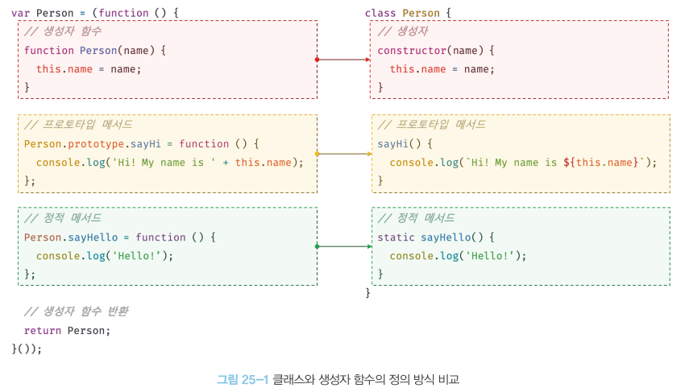

# 25. 클래스(25.1 ~ 25.6)
## 25.1 클래스는 프로토타입의 문법적 설탕인가?
- js는 프로토타입 기반 객체지향 언어로 강력한 객체지향 프로그래밍 능력을 지님
- 프로토타입 기반 객체지향 언어는 클래스가 필요 없는 객체지향 프로그래밍 언어다.
- ES5에서는 클래스 없이도 다음과 같이 생성자 함수와 프로토타입을 통해 객체지향 언어의 상속을 구현할 수 있다.
```
// ES5 생성자 함수
var Person = (function(){
    // 생성자 함수
    function Person(name){
        this.name = name;
    }

    // 프로토타입 메서드
    Person.prototype.sayHi = function(){
        console.log("Hi! My name is " + this.name)
    };

    // 생성자 함수 반환
    return Person;
}());

// 인스턴스 생성
var me = new Person("Lee");
me.sayHi();// Hi! My name is Lee

```
클래스는 생성자 함수와 매우 유사하게 동작하지만 다음과 같이 몇 가지 차이가 있다.
1. 클래스를 new 연산자 없이 호출하면 에러가 발생한다. 하지만 생성자 함수를 new 연산자 없이 호출하면 일반 함수로서 호출된다.
2. 클래스는 상속을 지원하는 extends와 super 키워드를 제공한다. 하지만 생성자 함수는 extends와 super 키워드를 지원하지 않는다.
3. 클래스는 호이스팅이 발생하지 않는 것처럼 동작한다. 하지만 함수 선언문으로 정의된 생성자 함수는 함수 호이스팅이 함수 표현식으로 정의한 생성자 함수는 변수 호이스팅이 발생한다.
4. 클래스 내의 모든 코드에는 암묵적으로 strict mode가 지정되어 실행되며 strict mode를 해제할 수 없다. 하지만 생성자 함수는 암묵적으로 strict mode가 지정되지 않는다.
5. 클래스의 constructor, 프로토타입 메서드, 정적 메서드는 모두 프로퍼티 어트리뷰트[[Enumerable]]의 값이 false다. 다시말해 열거되지 않는다.

- 생성자 함수와 클래스는 프로토타입 기반의 객체지향을 구현했다는 점에서 매우 유사.
- 클래스는 생성자 함수 기반의 객체 생성 방식보다 견고하고 명료.
- > 클래스를 프로토타입 기반 객체 생성 패턴의 단순한 문법적 설탕이라고 보기보다는 `새로운 객체 생성 메커니즘`으로 보는 것이 좀 더 합당하다.


## 25.2 클래스 정의
- class 키워드를 사용하여 정의.
- 클래스 이름은 생성자 함수와 마찬가지로 파스칼 케이스를 사용하는 것이 일반적
```
// 클래스 선언문
class Person{}
```

- 일반적이지 않은 방식 : 표현식으로 클래스 선언 가능
```
// 익명 클래스 표현식
const Person = class{};

// 기명 클래스 표현식
const Person = class MyClass{};
```
- 클래스를 표현식으로 정의한다는 것은 클래스가 값으로 사용할 수 있는 '일급 객체' 라는 것을 의미한다.
- 즉, 클래스는 일급객체로서 다음과 같은 특징을 갖는다.
1. 무명의 리터럴로 생성할 수 있다. 즉, 런타임에 생성가능
2. 변수나 자료규조(객체, 배열 등)에 저장 가능
3. 함수의 매개변수에 전달 가능
4. 함수의 반환값으로 사용 가능

- 클래스는 함수다. 따라서 클래스는 값처럼 사용할 수 있는 일급객체다. 
- 클래스 몸체에는 0개 이상의 메서드만 정의할 수 있다. 클래스 몸체에서 정의할 수 있는 매서드는 constructor(생성자), 프로토타입 메서드, 정적메서드 세 가지가 있다.
```
// 클래스 선언문
class Person {
    // 생성자
    constructor(name){
        //인스턴스 생성 및 초기화
        this.name = name;
    }

    // 프로토타입 메서드
    sayHi(){
        console.log("Hi! My name is ${this.name});
    }

    // 정적 메서드
    static sayHello(){
        console.log("Hello!");
    }
}

// 인스턴스 생성
const me = new Person("Lee");

// 인스턴스의 프로퍼티 참조
console.log(me.name);
//프로토타입 메서드 호출
me.sayHi(); // Hi! My name is Lee
// 정적 메서드 호출
Person.sayHello();//Hello


```
- 클래스와 생성자 함수 정의 방식을 비교해보면 다음과 같고, 클래스와 생성자 함수 정의 방식은 형태적인 면에서 매우 유사하다.



## 25.3 클래스 호이스팅
- 클래스는 함수로 평가된다.
```
// 클래스 선언문
class Person{}
console.log(typeof Person); // function
```
- 클래스 선언문으로 정의한 클래스는 함수 선언문과 같이 런타임 이전에 먼저 평가되어 함수 객체를 생성.
- 이 때 클래스가 평가되어 생성된 함수 객체는 생성자 함수로서 호출할 수 있는 함수, 즉 constructor다. 생성자 함수로 호출할 수 있는 함수는 함수 정의가 평가되어 함수 객체를 생성하는 시점에 프로토타입도 더불어 생성된다.(19.5절 프로토타입의 생성 시점 참고)
- 프로토타입과 생성자 함수는 단독으로 존재할 수 없고 언제나 쌍으로 존재하기 때문
- `단, 클래스는 클래스 정의 이전에 참조할 수 없다.`
```console.log(Person);
//ReferenceError: Cannot access 'Person' before initialization

// 클래스 선언문
class Person{}
```
- 클래스 선언문은 마치 호이스팅이 발생하지 않는 것처럼 보이나 그렇지 않다.

```
const = Person = "";
{
    // 호이스팅이 발생하지 않는다면 ""이 출력되어야 한다.
    console.log(Person);
    //ReferenceError: Cannot access 'Person' before initialization

    // 클래스 선언문
    class Person{}
}
```
- 클래스 선언문도 변수 선언, 함수 정의와 마찬가지로 호이스팅이 발생.
단, 클래스는 let, const 키워드로 선언한 변수처럼 호이스팅된다. 따라서 클래스 선언문 이전에 일시적 사각지대에 빠지기 떄문에 호이스팅이 발생하지 않는것처럼  동작하는 것

- `var, let, const, function*, class 키워드를 사용하여 선언된 모든 식별자는 호이스팅된다.` 모든 선언문은 런타임 이전에 먼저 실행되기 때문.


## 25.4 인스턴스 생성
- 클래스는 생성자 함수이며 new 연산자와 함께 호출되어 인스턴스를 생성한다.
```
class Peson {}

//인스턴스생성
const me = new Person();
console.log(me);// Person{}
```


- 함수는 new 연산자의 사용 여부에 따라 일반함수로 호출되거나 인스턴스 생성을 위한 생성자 함수로 호출되지만 클래스는 인스턴스를 생성하는 것이 유일한 존재이유이므로 반드시 new 연산자와 함께 호출해야 한다.
```
class Person{}

// 클래스를 new 연산자 없이 호출하면 타입 에러가 발생.
const me = Person();
// TypeError : Class constructor Foo cannot be invoked without 'new'
```


- 클래스 표현식으로 정의된 클래스의 경우 다음 예제와 같이 클래스를 가리키는 식별자(Person)을 사용해 인스턴스를 생성하지 않고 기명 클래스 표현식의 클래스 이름(MyClass)를 사용해 인스턴스를 생성하면 에러가 발생한다.
```
const Person = class MyClass{};

// 함수 표현식과 마찬가지로 클래스를 가리키는 식별자로 인스턴스를 생성해야 한다.
const me = new Person();

// 클래스 이름 MyClass는 함수와 동일하게 클래스 몸체 내부에서만 유효한 식별자다.
console.log(MyClass); //ReferenceError: MyClass is not defined

const you = new MyClass(); //ReferenceError: MyClass is not defined
```

- 이는 기명함수 표현식과 마찬가지로 클래스 표현식에서 사용한 클래스 이름은 외부 코드에서 접근 불가능하기 떄문.


## 25.5 메서드
- 클래스 몸체에는 0개 이상의 메서드만 선언할 수 있다.
- 클래스 몸체에서 정의할 수 있는 메서드는 생성자, 프로토타입메서드, 정적메서드 세가지다.

### 25.5.1 constructor
- constructor는 인스턴스를 생성하고 초기화하기위한 특수 메서드. constructor는 이름을 변경할 수 없다.
- 클래스는 인스턴스를 생성하기위한 생성자 함수다.
```
// 클래스는 함수다.
console.log(typeof Person); // function
console.dir(Person);
```

- 18.2절 함수 객체의 프로퍼티에서 살펴 보았듯이 클래스도 함수 객체 고유의 프로퍼티를 모두 갖고있다. 함수와 동일하게 프로토타입과 연결돼 있으며 자신의 스코프 체인을 구성함
- 모든 함수 객체가 갖고있는 prototype 프로퍼티가 가리키는 프로토타입 객체의 constructor 프로퍼티는 클래스 자신을 가리키고 있다. 이는 클래스가 인스턴스를 생성하는 생성자 함수라는 것을 의미한다. 즉 new 연산자와 함께 클래스를 호출하면 클래스는 인스턴스를 생성한다.

```
// 인스턴스 생성
const me = new Person("Lee");
console.log(me);
```

- Person클래스 constructor 내부에서 this에 추가한 name 플퍼티가 클래스가 생성한 인스턴스 프로퍼티로 추가된 것을 확인할 수 있따. 즉 생성자 함수와 마찬가지로 constructor 내부에서 this에 추가한 프로퍼티는 인스턴스 프로퍼티가 된다. constructor내부의 this는 생성자 함수와 마찬가지로 클래스가 생성한 인스턴스를 가리킨다.
```
// 클래스
class Person{
    // 생성자
    constructor(name){
        // 인스턴스 생성 및 초기화
        this.name = name;
    }
}

// 생성자 함수
function Person(name){
    // 인스턴스 생성 및 초기화
    this.name = name;
}

```
- 클래스가 평가돼 생성된 함수객체나 클래스가 생성한 인스턴스 어디에도 constructor가 보이지 않는다. 이는 클래스 몸체에 정의한 constructor가 단순한 메서드가 아니라는 것을 의미한다.

### 25.5.2 프로토타입 메서드
- 생성자 함수를 사용해 인스턴스를 생성하는 경우 프로토타입 메서드를 생성하기위해 다음과 같이 명시적으로 프로토타입에 메서드를 추가해야함

```
// 생성자 함수
function Person(name){
    this.name = name;
}

// 프로토타입 메서드
Person.prototype.sayHi = function(){
    console.log("Hi! My name is ${this.name}");

    const me = new Person("Lee");
    me.sayHi(); // Hi! My name is Lee
}

```


- 클래스 몸체에서 정의한 메서드는 생성자 함수에 의한 객체 생성 방식과 다르게 클래스의 prototype 프로퍼티에 메서드를 추가하지 않아도 기본적으로 프로토타입 메서드가 된다.
- 생성자 함수와 마찬가지로 클래스가 생성한 인스턴스는 프로토타입 체인의 일원이 된다.


### 25.5.3 정적 메서드
- 19.12절 "정적 프로퍼티/메서드"에 살펴봤듯이 정적 메서드는 인스턴스를 생성하지 않아도 호출할 수 있는 메서드를 말한다.

```
class Person {
// 생성자
    constructor(name){
        // 인스턴스 생성 및 초기화
        this.name = name;
    }

    // 정적 메서드
    static sayHi(){
        console.log("Hi");
    }
}

// 정적 메서드는 클래스로 호출한다.
// 정적 메서드는 인스턴스 없이도 호출할 수 있다.
Peson.sayHi(); // Hi!
```

- 클래스에서 메서드에 static 키워드를 붙이면 정적메서드(클래스메서드)가 된다.
- 클래스 정의가 평가되는 시점에 함수객체가 되므로 인스턴스와 달리 별다른 생성과정이 필요 없음.
- >정적메서드는 클래스 정의 이후 인스턴스를 생성하지 않아도 호출 가능
- >정적 메서드는 프로토타입 메서드처럼 인스턴스로 호출하지 않고 클래스로 호출함
- 정적 메서드는 인스턴스로 호출할 수 없다.
- 정적 메서드가 바인딩된 클래스는 인스턴스의 프로토타입 체인상에 존재하지 않기 때문. 프로토타입 체인 상에는 클래스가 존재하지 않기 떄문에 인스턴스로 클래스의 메서드를 상속받을 수 없다.
```
// 인스턴스 생성
const me = new PErson("Lee");
me.sayHi(); // TypeError : me.sayHi is not a function
```
### 25.5.4 정적 메서드와 프로토타입 메서드의 차이
1. 정적 메서드와 프로토타입 메서드는 자신이 속해 있는 프로토타입 체인이 다르다.
2. 정적 메서드는 클래스로 호출하고 프로토타입 메서드는 인스턴스로 호출한다.
3. 정적 메서드는 인스턴스 프로퍼티를 참조할 수 없지만 프로토타입 메서드는 인스턴스 프로퍼티를 참조할 수 있다.

- this를 사용하지 않는 메서드는 정적 메서드로 정의 하는 것이 좋다.

### 25.5.5 클래스에서 정의한 메서드의 특징
1. function키워드를 생략한 메서드 축약표현을 사용
2. 객체 리터럴과 다르게 메서드 정의 시 콤마 필요 없음
3. 암묵적으로 strick mode로 실행
4. fon...in문이나 Object.keys메서드 등으로 열거 불가.
5. 내부메서드를 갖지 않는 non-constructor이다. 따라서 new연산자와 함께 호출 불가

## 25.6 클래스의 인스턴스 생성 과정
1. 인스턴스 생성과 this 바인딩
2. 인스턴스 초기화
3. 인스턴스 반환

