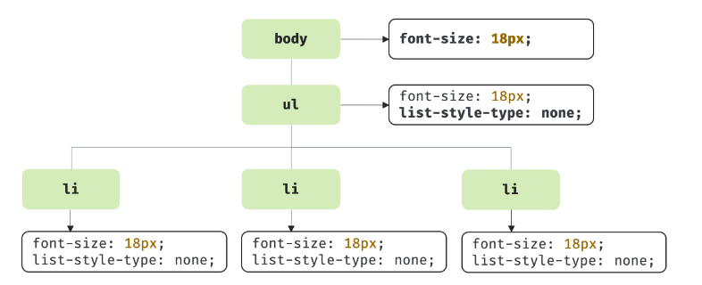
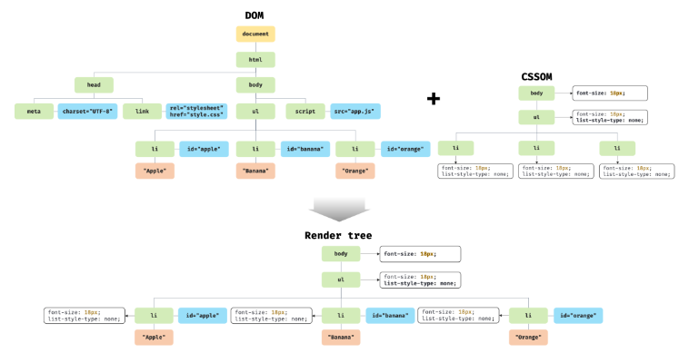

# 38장 브라우저의 렌더링 과정

## 38.1 요청과 응답

- 브라우저의 핵심 기능 : 필요한 리소스를 서버에 요청하고 서버로부터 응답받아 브라우저에 시각적으로 렌더링 하는 것

  - 필요한 리소스 : HTML, CSS, 자바스크립트, 이미지, 폰트 등의 정적파일 또는 서버가 동적으로 생성한 데이터

- 서버는 루트 요청에 대해 암묵적으로 index.html을 응답하도록 기본설정 되어있다.
  - 루트 요청 : /, 스킴+호스트만으로 구성된 URI에 의한 요청 (ex. https://www.naver.com -> https://www.naver.com/index.html 과 같은 요청임)
- 요청과 응답은 개발자 도구의 Network 패널에서 확인할 수 있다.
- Network 패널을 살펴보면 index.html 뿐만 아니라 CSS, 자바스크립트, 이미지, 폰트 파일들도 응답된 것을 확인할 수 있음
  - 브라우저의 렌더링 엔진이 HTML(index.html)을 파싱하는 도중에 외부 리소스를 로드하는 태그를 만나면 HTML의 파싱을 일시 중단하고 해당 리소스 파일을 서버로 요청하기 때문

<br />

## 38.2 HTTP 1.1과 HTTP 2.0

- HTTP(HyperText Transfer Protocol)는 웹에서 브라우저와 서버가 통신하기 위한 프로토콜(규약)
  
- HTTP/1.1

  - 커넥션당 하나의 요청과 응답만 처리한다.
  - `리소스의 동시 전송이 블가능`한 구조이므로 요청할 리소스의 개수에 비례하여 응답 시간도 증가하는 단점

- HTTP/2
  - 커넥션당 `여러 개의 요청과 응답이 가능`하다.
  - 여러 리소스의 동시 전송이 가능하므로 HTTP/1.1에 비해 50% 정도 빠르다고 알려짐

<br />

## 38.3 HTML 파싱과 DOM 생성

- 브라우저의 요청에 의해 서버가 응답한 HTML 문서는 문자열로 이루어진 순수한 텍스트다. 브라우저에 시각적인 픽셀로 렌더링하려면 HTML 문서를 브라우저가 이해할 수 있는 자료구조(객체)로 변환하여 메모리에 저장해야 한다.

예제)

```
<!DOCTYPE html>
<html>
  <head>
    <meta charset="UTF-8">
    <link rel="stylesheet" href="style.css">
  </head>
  <body>
    <ul>
      <li id="apple">Apple</li>
      <li id="banana">Banana</li>
      <li id="orange">Orange</li>
    </ul>
    <script src="app.js"></script>
  </body>
</html>
```


1. 서버에 존재하던 HTML 파일이 브라우저의 요청에 의해 응답된다. 이때 서버는 브라우저가 요청한 HTML 파일을 읽어 들여 메모리에 저장한 다음 메모리에 저장된 `바이트`(2진수)를 인터넷을 경유하여 응답한다.
2. 브라우저는 서버가 응답한 HTML 문서를 바이트(2진수) 형태로 응답받는다. 그리고 응답된 바이트 형태의 HTML 문서는 meta 태그의 charset 어트리뷰트에 의해 지정된 인코딩 방식(예: UTF-8)을 기준으로 `문자`열로 변환된다.
3. 문자열로 변환된 HTML 문서를 읽어 들여 문법적 의미를 갖는 코드의 최소 단위인 `토큰`들로 분해된다.
4. 각 토큰들을 객체로 변환하여 `노드`들을 생성한다. 토큰의 내용에 따라 문서 노드, 요소 노드, 어트리뷰트 노드, 텍스트 노드가 생성된다. 노드는 이후 DOM을 구성하는 기본 요소가 된다.
5. HTML 문서는 HTML 요소들의 집합으로 이루어지며 HTML 요소는 중첩 관계를 갖는다. 즉, HTML 요소의 콘텐츠 영역(시작 태그와 종료 태그 사이)에는 텍스트 뿐만 아니라 다른 HTML 요소도 포함될 수 있다. 이때 HTML 요소 간에는 중첩 관계에 의해 부자 관계가 형성된다. 이러한 HTML 요소 간의 부자 관계를 반영하여 `모든 노드들을 트리 자료구조로` 구성한다. 이 노드들로 구성된 트리 자료구조를 `DOM`(Document Object Model)이라 부른다.

- 즉, DOM은 HTML 문서를 파싱한 결과물이다.

<br />

## 38.4 CSS 파싱과 CSSOM 생성

- 렌더링 엔진은 HTML을 처음부터 한 줄씩 순차적으로 파싱하여 DOM을 생성해 나가다가 CSS를 로드하는 link 태그나 style 태그를 만나면 DOM 생성을 일시 중단한다.
- 로드한 CSS를 HTML과 동일한 파싱 과정(바이트→문자→토큰→노드→CSSOM)을 거치며 해석하여 `CSSOM(CSS Object Model)`을 생성한다.
- 이후 CSS 파싱을 완료하면 HTML 파싱이 중단된 지점부터 다시 HTML을 파싱하기 시작하여 DOM 생성을 재개한다.

```
body {
  font-size: 18px;
}
ul {
  list-style-type: none;
}
```



- CSSOM은 CSS의 상속을 반영하여 생성된다. 위 예제에서 body 요소에 적용한 font-size 프로퍼티와 ul 요소에 적용한 list-style-type 프로퍼티는 모든 li 요소에 상속된다.

<br />

## 38.5 렌더 트리 생성

- 렌더링 엔진은 서버로부터 응답된 HTML과 CSS를 파싱하여 각각 DOM과 CSSOM을 생성한다. 그리고 `DOM과 CSSOM은 렌더링을 위해 렌더 트리로 결합`된다.
- 렌더 트리는 렌더링을 위한 트리 구조의 자료구조로, 브라우저 화면에 렌더링되는 노드만으로 구성된다.



- 이후 완성된 렌더 트리는 각 HTML 요소의 레이아웃을 계산하는 데 사용되며 브라우저 화면에 픽셀을 렌더링하는 페인팅 처리에 입력된다.


- 지금까지 살펴본 브라우저의 렌더링 과정은 반복해서 실행될 수 있다.
- 다음과 같은 경우 반복해서 레이아웃(위치와 크기) 계산과 페인팅이 재차 실행된다.
  - 자바스크립트에 의한 노드 추가 또는 삭제
  - 브라우저 창의 리사이징에 의한 뷰포트 크기 변경
  - HTML 요소의 레이아웃에 변경을 발생시키는 width/height, margin, padding, border, display, position 등의 스타일 변경
- 리렌더링은 성능에 악영향을 주는 작업이므로 가급적 리렌더링이 빈번하게 발생하지 않도록 주의할 필요가 있다.

<br />

## 38.6 자바스크립트 파싱과 실행

- 자바스크립트 파싱과 실행은 자바스크립트 엔진이 처리한다.


1. `토크나이징`  
   단순한 문자열인 자바스크립트 소스코드를 어휘분석하여 문법적 의미를 갖는 코드의 최소 단위인 토큰들로 분해한다.
2. `파싱`  
   토큰들의 집합을 구문분석하여 AST(추상적 구문 트리)를 생성한다. AST는 토큰에 문법적 의미와 구조를 반영한 트리 구조의 자료구조다.
3. `바이트코드 생성과 실행`  
   파싱의 결과물로서 생성된 AST는 인터프리터가 실행할 수 있는 중간 코드인 바이트코드로 변환되고 인터프리터에 의해 실행된다.

<br />

## 38.7 리플로우와 리페인트

- 자바스크립트 코드에 DOM이나 CSSOM을 변경하는 DOM API가 사용된 경우 DOM이나 CSSOM이 변경된다. 이때 변경된 DOM과 CSSOM은 다시 렌더트리로 결합되고 변경된 렌더 트리를 기반으로 레이아웃과 페인트 과정을 거쳐 브라우저의 화면에 다시 렌더링한다. 이를 `리플로우`, `리페인트`라 한다.


- 리플로우 : 레이아웃 계산을 다시 하는 것 (노드 추가/삭제, 윈도우 리사이징 등 레이아웃에 영향을 주는 변경이 발생한 경우에 한하여 실행)
- 리페인트 : 재결합된 렌더 트리를 기반으로 다시 페인트를 하는 것

<br />

## 38.8 자바스크립트 파싱에 의한 HTML 파싱 중단

- 렌더링 엔진과 자바스크립트 엔진은 병렬적으로 파싱을 실행하지 않고 직렬적으로 파싱을 수행한다.
- 이처럼 브라우저는 동기적으로, 즉 위에서 아래 방향으로 순차적으로 HTML, CSS, 자바스크립트를 파싱하고 실행한다.
- 이것은 script 태그의 위치에 따라 HTML 파싱이 블로킹되어 DOM 생성이 지연될 수 있다는 것을 의미한다.

예제)

```
<!DOCTYPE html>
<html>
  <head>
    <meta charset="UTF-8">
    <link rel="stylesheet" href="style.css">
    <script>
      /*
      DOM API인 document.getElementById는 DOM에서 id가 'apple'인 HTML 요소를 취득한다.
      아래 DOM API가 실행되는 시점에는 아직 id가 'apple'인 HTML 요소를 파싱하지 않았기 때문에
      DOM에는 id가 'apple'인 HTML 요소가 포함되어 있지 않다.
      따라서 아래 코드는 정상적으로 id가 'apple'인 HTML 요소를 취득하지 못한다.
      */
      const $apple = document.getElementById('apple');

      // id가 'apple'인 HTML 요소의 css color 프로퍼티 값을 변경한다.
      // 이때 DOM에는 id가 'apple'인 HTML 요소가 포함되어 있지 않기 때문에 에러가 발생한다.
      $apple.style.color = 'red'; // TypeError: Cannot read property 'style' of null
    </script>
  </head>
  <body>
    <ul>
      <li id="apple">Apple</li>
      <li id="banana">Banana</li>
      <li id="orange">Orange</li>
    </ul>

  // 자바스크립트를 이 위치에 위치시키는 것이 좋다.
  </body>
</html>
```

- 위 같은 문제를 회피하기 위해 body 요소의 가장 아래에 자바스크립트를 위치시키는 것은 좋은 아이디어다.
  - DOM이 완성되지 않은 상태에서 자바스크립트가 DOM을 조작하면 에러가 발생할 수 있다.
  - 자바스크립트 로딩/파싱/실행으로 인해 HTML 요소들의 렌더링에 지장받는 일이 발생하지 않아 페이지 로딩 시간이 단축된다.

<br />

## 38.9 script 태그의 async/defer 어트리뷰트

- 자바스크립트 파싱에 의한 DOM 생성이 중단되는 문제를 근본적으로 해결하기 위해 HTML5부터 script 태그에 async와 defer 어트리뷰트가 추가되었다.
- async와 defer 어트리뷰트를 사용하면 HTML 파싱과 외부 자바스크립트 파일의 로드가 비동기적으로 동시에 진행된다. 하지만 자바스크립트의 실행 시점에 차이가 있다.

```
<script async src="extern.js"></script>
<script defer src="extern.js"></script>
```

- async 어트리뷰트
  

  - 자바스크립트의 파싱과 실행은 자바스크립트 파일의 로드가 완료된 직후 진행되며, 이때 HTML 파싱이 중단된다.
  - 여러 개의 script 태그에 async 어트리뷰트를 지정하면 script 태그의 순서와는 상관없이 로드가 완료된 자바스크립트부터 먼저 실행되므로 `순서가 보장되지 않는다.` 따라서 순서 보장이 필요한 script 태그에는 async 어트리뷰트를 지정하지 않아야 한다.

- defer 어트리뷰트
  
  - 자바스크립트의 파싱과 실행은 HTML 파싱이 완료된 직후, 즉 DOM 생성이 완료된 직후 진행된다.
  - 따라서 `DOM 생성이 완료된 이후 실행되어야 할 자바스크립트에 유용하다.`
