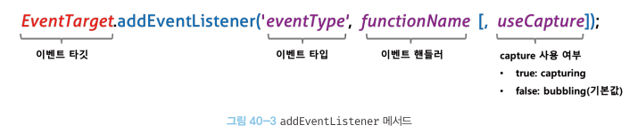
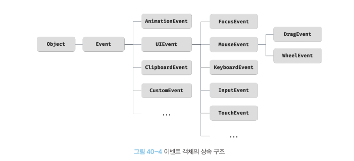

# 이벤트
## 40.1 이벤트 드리븐 프로그래밍
- 브라우저는 처리해야할 특정 사건(클릭, 키보드입력, 마우스 이동 등)이 발생하면 브라우저는 이를 감지하여 특정 타입의 이벤트를 발생시킴
- 어플리케이션이 이벤트에 반응해서 어떤 일을 하고싶으면 이벤트 발생때 호출되는 함수를 브라우저에게 알려 호출을 위임함
- `이벤트 핸들러` : 이벤트가 발생했을 때 호출된 함수
- `이벤트 핸들러 등록` : 브라우저에게 이벤트 핸들러의 호출을 위임하는 것
- 함수를 언제 호출할 지 알 수 없어 개발자가 호출하는게 아니라 브라우저에게 함수 호출을 위임.

```
<button>Click me!</button>
<script>
    const $button = document.querySelector("button");
    //사용자가 버튼을 클릭하면 함수를 호출하도록 요청
    $button.onclick = () => { alert('button click'); };
</script>
```
- 위의 예시는 버튼요소 $button의 onclick 프로퍼티에 함수를 할당
- 이벤트 핸들러 프로퍼티에 함수를 할당하면 해당 이벤트가 발생했을 때 할당한 함수가 브라우저에 의해 호출된다.
- 이벤트와 이벤트핸들러를 통해 어플리케이션은 사용자와 상호작용을 할 수 있다. 이와 같이 프로그램 흐름을 중심으로 제어하는 프로그래밍 방식을 `이벤트 드리븐 프로그래밍`이라 한다.
- (* Window, Document, HTMLElement타입의 객체는 onclick과 같이 특정 이벤트에 대응하는 다양한 이벤트 핸들러 프로퍼티를 가지고 있다.)

## 40.2 이벤트 타입
### 40.2.1 마우스 이벤트
- click, dblclick, mousedown, mouseup, mousemove, mouseenter, mouseover, mouseleave, mouseout

### 40.2.2 키보드 이벤트
- keydown, keypress, keyup

### 40.2.3 포커스 이벤트
- focus, blur, focusin, focusout

### 40.2.4 폼 이벤트
- submit, reset

### 40.2.5 값 변경 이벤트
- input, change, readystatechange

### 40.2.6 DOM 뮤테이션 이벤트
- DOMContentLoaded

### 40.2.7 뷰 이벤트
- resize, scroll

### 40.2.8 리소스 이벤트
- load, unload, abort, error

## 40.3 이벤트 핸들러 등록
- 한번더 말하자면 `이벤트 핸들러`는 이벤트가 발생했을 때 브라우저에 호출을 위임한 함수다.
- 또 다시말해보자면 이벤트가 발생하면 브라우저에 의해 호출될 함수가 `이벤트 핸들러`다.
- 이벤트 발생 시 브라우저에게 이벤트 핸들러의 호출을 위임하는 것을 `이벤트 핸들러 등록`이라 한다.
- 이 등록 방법은 3가지가 있다.

### 40.3.1 이벤트 핸들러 어트리뷰트 방식
- HTML 요소의 어트리뷰트 중, 이벤트에 대응하는 이벤트 핸들러 어트리뷰트가 있다.
- 이벤트 핸들러 어트리뷰트의 이름은 onclick과 같이 on 접두사와 이벤트 종류를 나타내는 이벤트 타입으로 이루어짐.
이벤트 핸들러 어트리뷰트 값으로 함수 호출문 등의 문을 할당하면 이벤트 핸들러가 등록된다.
```
<button onclick = "sayHi('Lee')">Click me!</button>
<script>
    function sayHi(name){
        console.log(`Hi! ${name}.`);
    }
</script>
```
- 중요한 것은 이벤트 핸들러 어트리뷰트 값으로 함수 참조가 아닌 함수 호출문 등의 문을 할당한다는 것.
- 이벤트 핸들러프로퍼티 방식에서는 DOM 노드 이벤트 핸들러 프로퍼티에 함수참조를 할당한다.
- 이벤트 핸들러를 등록할 때 콜백 함수와 마찬가지로 함수 참조를 등록해야 브라우저가 이벤트 핸들러를 호출할 수 있다. 만약 함수 참조가 아니라 함수 호출문을 등록하면 함수 호출문의 평가 결과가 이벤트 핸들러로 등록된다. 함수를 반환하는 고차 함수 호출문을 이벤트 핸들러로 등록한다면 문제가 없지만 함수가 아닌 값을 반환하는 함수 호출문을 이벤트핸들러로 등록하면 브라우저가 이벤트 핸들러를 호출할 수 없다.
- 이 방식은 이제 권장되지 않지만 모던 자바스크립트에서는 이벤트 핸들러 어트리뷰트 방식을 사용하는 경우가 있다. CBD 방식의 프레임워크(앵귤러, 리액트 뷰 등)에서는 본 방식으로 이벤트를 처리함. 

### 40.3.2 이벤트 핸들러 프로퍼티 방식
- window, Document, HTMLElement 타입의 DOM 노드 객체는 이벤트 핸들러 프로퍼티를 가지고 있다.
- 키는 이벤트 핸들러 어트리뷰트와 마찬가지로 onclick과 같이 on 접두사와 이벤트 종류를 나타내는 이벤트 타입으로 이루어짐
- 이벤트 핸들러 프로퍼티에 함수를 바인딩하면 이벤트 핸들러가 등록됨.
```
<button>Click me!</button>
<script>
    const $button = document.querySelector("button");
    //사용자가 버튼을 클릭하면 함수를 호출하도록 요청
    $button.onclick = function { alert('button click'); };
</script>
```
- 이벤트 타깃과 이벤트 종류를 나타내는 문자열인 이벤트 타입 그리고 이벤트 핸들러를 지정해야한다.
* 이벤트 타깃 : $button
* on+이벤트타입 : onclick
* function = 이벤트 핸들러

- 이벤트 핸들러는 이벤트 타깃 또는 DOM노드 객체에 바인딩.
- 앞서 살펴본 `이벤트 핸들러 어트리뷰트 방식`도 결국 DOM노드 객체의 이벤트 핸들러 프로퍼티로 변환되므로 결과적으로 본 방식과 같음.
- 이벤트 핸들러 프로퍼티에 하나의 이벤트 핸들러만 바인딩 한다는 단점이 있음.

### 40.3.3 addEventListener 메서드 방식
- DOM Level2에서 도입된 EventTarget.prototype.addEventListener 메서드를 사용하여 이벤트 핸들러를 등록할 수 있음.
- 직전의 두 방식은 DOM Level0부터 제공된 방식.
  

- 첫번째 매개변수는 이벤트 타입을 전달(on접두사 없이)
- 두번째 매개변수는 이벤트 핸들러 전달
- 이벤트 캐치할 이벤트 전파 단계를 지정 또는 생략가능(false는 버블링 단계에서 이벤트 캐치, true는 캡처링 단계에서 이벤트 캐치)

```
<button>Click me!</button>
<script>
    const $button = document.querySelector("button");
    //사용자가 버튼을 클릭하면 함수를 호출하도록 요청
    //$button.onclick = function { alert('button click'); };

    $button.addEventListener('click', function(){
        alert('button click');
    });
</script>
```
- 프로퍼티 방식은 이벤트 핸들러 프로퍼티에 이벤트 핸들러를 바인딩하지만 addEventListener메서드에는 이벤트 핸들러를 인수로 전달한다.
- 프로퍼티방식과 이벤트리스너방식 두개가 모두 설정된 경우에는 이벤트 발생시 2개의 이벤트 핸들러가 모두 호출된다.
- 이벤트 핸들러는 등록된 순서대로 호출된다.
- 단 이벤트리스너 메서드를 통해 참조가 동일한 이벤트 핸들러를 중복 등록하면 하나의 이벤트만 등록된다.

## 40.4 이벤트 핸들러 제거
- EventTarget.prototype.removeEventListener 메서드를 사용.
- 메소드에 전달할 인수는 add메소드와 동일하다.
- 단 add와 remove 메소드에 전달한 인수가 일치해야 제거된다.
- 무명함수는 제거 불가.(변수나 자료구조에 저장해야 제거됨)

## 40.5 이벤트 객체
- 이벤트 발생 시 이벤트에 관련한 다양한 정보를 담는 이벤트 객체가 동적으로 생성
- 생성된 이벤트 객체는 이벤트 핸들러의 첫번째인수로 전달.

```
<p>클릭하세요. 클릭한 곳의 좌표가 표시됩니다.</p>
<em class="message"></em>
<script>
    const $msg = document.querySelector('.message');
    // 클릭 이벤트에 의해 생성된 이벤트 객체는 이벤트 핸들러의 첫 번째 인수로 전달된다.
    function showCoords(e){
        $msg.textContent - `clientX: ${e.clicntX}, clicntY: ${e.clientY}`;
    }
    document.onclick = showCoords;
</script>
```
- 클릭이벤트에 의해 생성된 객체는 이벤트 핸들러의 첫번째 인수로 전달되어 매개변수 e에 암묵적으로 할당된다. 이는 브라우저가 이벤트 핸들러를 호출할 때 이벤트 객체를 인수로 전달하기 때문이다.
- 이벤트 객체를 전달받으려면 이벤트 핸들러를 정의할 때 이벤트 객체를 전달받을 매개변수를 명시적으로 선언해야한다. 위 예제에서는 e라는 이름으로 매개변수를 선언했으나 다른이름을 사용해도 된다.
- 이벤트 핸들러 어트리뷰트 방식을 사용한다면 첫번째 매개변수 이름이 반드시 event여야 한다. 암묵적으로 생성되는 이벤트 핸들러의 함수 몸체를 의미하기 때문.
- onclick="showCoords(event)" 어트리뷰트는 파싱되어 onclick이벤트 핸들러 프로퍼티에 할당한다.

### 40.5.1 이벤트 객체의 상속 구조
- 이벤트가 발생하면 다양한 타입의 이벤트객체가 생성됨.
- 상속구조는 다음과 같다.
  
  - 그림의 Event, UIEvent, MouseEvent 등 모두는 생성자 함수다. 따라서 생성자 함수를 호출하여 이벤트객체를 생성할 수 있다.

  - 이처럼 이벤트가 발생하면 암묵적으로 생성되는 이벤트 객체도 생성자 함수에 의해 생성됨
  - 생성된 이벤트 객체는 생성자 함수와 더불어 생성되는 프로토타입으로 구성된 프로토타입 체인의 일원.
  - 클릭이벤트가 발생하면 암묵적으로 생성되는 MouseEvent 타입의 이벤트 객체는 프로토 타입 체인의 일원이된다.(771페이지 참고)
  - Event 인터페이스에는 모든 이벤트 객체의 공통 프로퍼티가 정의돼있고, FocusEvent, MouseEvent, KeyboardEvent, WheelEvent 같은 하위 인터페이스에는 이벤트 타입에 따른 고유 프로퍼티가 정의됨.

  ### 40.5.2 이벤트 객체의 공통 프로퍼티
  - Event 인터페이스, 즉 Event.prototype에 정의된 이벤트 관련 프로퍼티는 UIEvent, CustomEvent, MouseEvent 등 모든 파생이벤트 객체에 상속된다. 즉 Event 인터페이스의 이벤트 관련 프로퍼티는 모든 이벤트 객체가 상속받는 공통 프로퍼티다.

  ### 40.5.3 마우스 정보 취득
  - click, dblclick, mousedown, mouseup, mousemove, mouseleave 이벤트가 발생하면 생성되는 MouseEvent 타입의 이벤트 객체는 다음과 같은 고유의 프로퍼티를 갖는다.
  * 마우스 포인터 좌표 정보를 나타내는 프로퍼티 : screenX/screenY, clientX/clientY, pageX/pageY, offsetX/offsetY
  * 버튼 정보를 나타내는 프로퍼티 : altKey, ctrlKey, shiftKey, button 
  - 마우스 포인터 좌표는 MouseEvent 타입의 이벤트 객체에서 제공한다. client는 뷰포트 즉 웹페이지 가시영역을 기준으로 마우스 포인터 좌표를 나타낸다.

  ### 40.5.4 키보드 정보 취득
  - keydown, keyup, keypress 이벤트는 KeyboardEvent 타입의 이벤트 객체는 ctrlKey, shiftKey, metaKey, key, keyCode와 같은 고유 프로퍼티를 가짐
  - 참고로 input 요소의 입력 필드에 한글을 입력하고 엔터키를 누르면 keyup이벤트 핸들러가 두번 호출되는 현상이 발생한다. 이 같은 문제를 회피하려면 keyup이벤트 대신 keydown이벤트를 캐치한다.