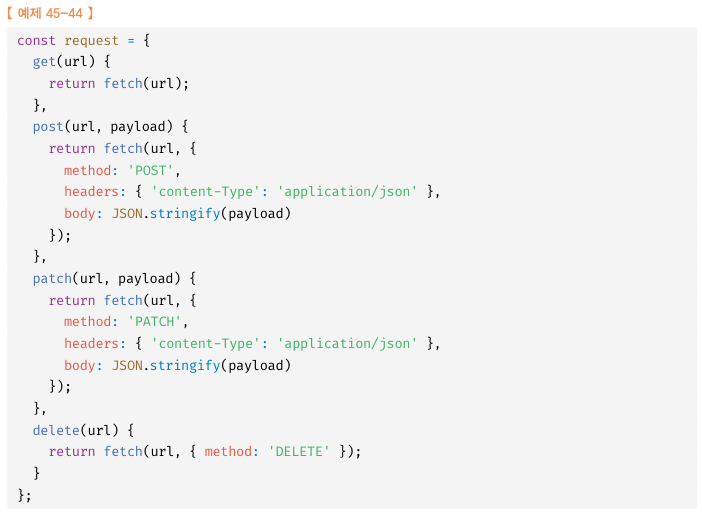
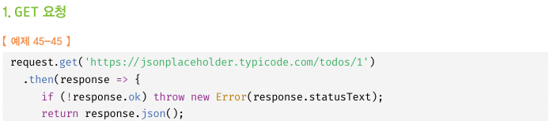
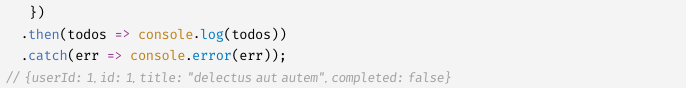
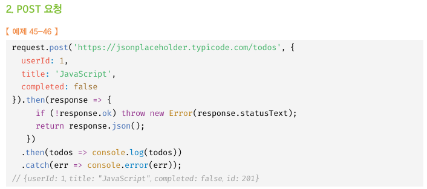
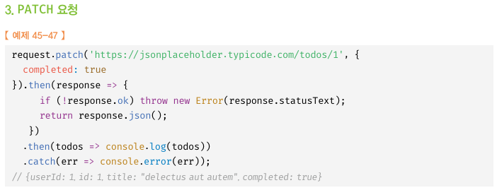
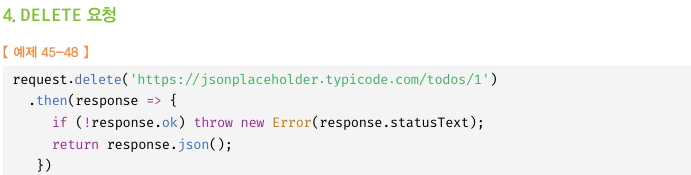
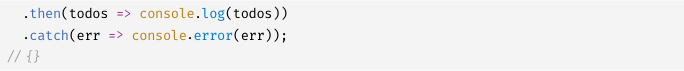

# 45장 프로미스
- 자바스크립트는 비동기 처리를 위한 하나의 패턴으로 콜백 함수를 사용한다. 하지만 전통적인 콜백 패턴은 콜백 헬로 인해 가독성이 나쁘고, 비동기 처리 중 발생한 에러의 처리가 곤란하며, 여러 개의 비동기 처리를 한번에 처리하는 데도 한계가 있다.
- ES6에서는 비동기 처리를 위한 또 다른 패턴으로 프로미스를 도입했다. 프로미스는 전통적인 콜백 패턴이 가진 단점을 보완하며 비동기 처리 시점을 명확하게 표현할 수 있다는 장점이 있다.

## 45.1 비동기 처리를 위한 콜백 패턴의 단점
### 45.1.1 콜백 헬
- 먼저 44.3.4절 "GET 요청"에서 살펴본 바와 같이 GET 요청을 위한 함수를 작성해 보자.

```
// GET 요청을 위한 비동기 함수
const get = url => {
    const xhr = new XMLHttpRequest();
    xhr.open('GET', url);
    xhr.send();

    xhr.onload = () => {
        if (xhr.status === 200){
            // 서버의 응답을 콘솔에 출력한다.
            console.log(JSON.parse(xhr.response));
        }else{
            console.error(`${xhr.status} ${xhr.statusText}`);
        }
    };
};

// id가 1인 post를 취득
get('http://jsonplaceholder.typicode.com/posts/1');
/*
{
    "userId": 1,
    "id": 1,
    "title": "sunt aut facere ...",
    "body": "quia et suscipit ..."
}
*/
```
- 위 예제는 get함수는 서버의 응답 결과를 콘솔에 출력한다. get함수가 서버의 응답 결과를 반환하게 하려면 어떻게될까?
- get함수는 비동기 함수다. 비동기 함수란 함수 내부에 비동기로 동작하는 코드를 포함한 함수를 말한다.
- 비동기 함수를 호출하려면 함수 내부의 비동기로 동작하는 코드가 완료되지 않았다 해도 기다리지 않고 즉시 종료된다.
- 즉, 비동기 함수 내부의 비동기로 동작하는 코드는 비동기 함수가 종료된 이후에 완료된다.
- 따라서 비동기 함수 내부의 비동기로 동작하는 코드에서 처리 결과를 외부로 반환하거나 상위 스코프의 변수에 할당하면 기대한 대로 동작하지 않는다.
- 예를들어 setTimeout 함수는 비동기 함수다. setTimeout 함수가 비동기 함수인 이유는 콜백 함수의 호출이 비동기로 동작하기 때문이다.
- setTimeout 함수를 호출하면 콜백 함수를 호출 스케줄링한 다음, 타이버 id를 반환하고 즉시 종료된다. 즉, 비동기 함수인 setTimeout 함수의 콜백 함수는 setTimeout 함수가 종료된 이후에 호출된다.
- 따라서 setTimeout 함수 내부의 콜백 함수에서 처리 결과를 외부로 반환하거나 상위 스코프의 변수에 할당하면 기대한 대로 동작하지 않는다.
- setTimeout 함수의 콜백 함수에서 상위 스코프의 변수에 값을 할당해보자. setTimeout 함수는 생성된 타이머를 식별할 수 있는 고유한 타이머 id를 반환하므로 콜백 함수에서 값을 반환하는 것은 무의미하다.


```
let g = 0;
// 비동기 함수인 setTimeout 함수는 콜백 함수의 처리 결과를 외부로 반환하거나 상위 스코프의 변수에 할당하지 못한다.
setTimeout(()=> { g = 100; }, 0);
console.log(g);//0
```

- GET 요청을 전송하고 서버의 응답을 전달받는 get 함수도 비동기 함수다. get 함수가 비동기 함수인 이유는 get 함수 내부의 onload 이벤트 핸들러가 비동기로 동작하기 때문이다. get 함수를 호출하면 GET 요청을 전송하고 onload이벤트 핸들러를 등록한 다음 undefined를 반환하고 즉시 종료된다.
- 비동기 함수인 get 함수 내부의 onload이벤트 핸들러는 get 함수가 종료된 이후에 실행된다.
- 따라서 get함수의 onload이벤트 핸들러에서 서버의 응답 결과를 반환하거나 상위 스코프의 변수에 할당하면 기대한대로 동작하지 않는다.


```
//GET요청을 위한 비동기 함수
const get = url =>{
    const xhr = new XMLHttpRequest();
    xhr.open('GET',url);
    xhr.send();

    xhr.onload = () => {
        if (xhr.status === 200){
            // 1. 서버의 응답을 반환
            return JSON.parse(xhr.response);
        }else{
            console.error(`${xhr.status} ${xhr.statusText}`);
        }
    };
};

// 2. id가 1인 post를 취득
const reponse = get('http://jsonplaceholder.typicode.com/posts/1');
console.log(response); //undefined
}
```
- xhr.onload핸들러 프로퍼티에 바인딩한 이벤트 핸들러가 즉시 실행되는 것이 아니다. xhr.onload이벤트는 핸들러는 load이벤트가 발생하면 일단 태스크 큐에 저장되어 대기하다가 콜 스택이 비면 이벤트 루프에 의해 콜 스택으로 푸시되어 실행된다.

- 콜백 함수를 비동기 처리 결과에 대한 후속 처리를 수행하는 비동기 함수가 비동기 처리 결과를 가지고 또다시 비동기 함수를 호출해야 한다면 콜백 함수 호출이 중첩되어 복잡도가 높아지는 현상이 발생하는데, 이를 `콜백 헬`이라 한다.


### 45.1.2 에러 처리의 한계
- 비동기 처리를 위한 콜백 패턴의 문제점 중 가장 심각한 것은 에러처리가 곤란하다는 것이다.
- try코드 블록 내에서 호출한 setTimeout함수는 1초후 콜백함수가 실행되도록 타이머를 설정하고, 이후 콜백함수는 에러를 발생시킨다. 하지만 에러로 캐치되지 않는다.
- setTimeout이 호출되면 함수 실행 컨텍스트가 실행되어 콜 스택에 푸시된다.
- setTimeout은 비동기 함수이므로 콜백 함수가 호출되는 것을 기다리지 않고 즉시 종료되어 콜 스택에서 제거된다.
- 이후 타이머가 만료되면 setTImeout 함수의 콜백함수는 태스크 큐로 푸시되고 콜 스택이 비어졌을 때 이벤트 루프에 의해 콜 스택으로 푸시되어 실행된다.
- setTimeout함수의 콜백함수가 실행될 때 setTimeout함수는 이미 콜 스택에서 제거된 상태다. 이것은 setTimeout함수의 콜백함수를 호출한것이 setTimeout이 아니라는 것이다.
- `에러는 호출자 방향으로 전파된다.`
- 콜스택의 아래방향으로 전파되는데 앞에서 setTimeout함수의 콜백함수를 호출한 것은 setTimeout함수가 아니다. 따라서 setTimeout함수의 콜백함수가 발생시킨 에러는 catch블록에서 캐치가 안된다.
- 이를 극복하기 위해 ES6에서 프로미스가 도입되었다.

## 45.2 프로미스의 생성
- Promise 생성자 함수를 new 연산자와 함꼐 호출하면 프로미스(Promise 객체)를 생성한다. ES6에서 도입된 프로미스는 호스트 객체가 아닌 ECMAScript 사양에 정의된 표준 빌트인 객체다.
- 프로미스 생성자 함수는 비동기 처리를 수행할 콜백함수를 인수로 전달받는데, 이 콜백 함수는 resolve와 reject함수를 인수로 전달받는다.

```
//프로미스 생성
const promis = new Promis((resolve, reject)=> {
    //프로미스 함수의 콜백 함수 내부에서 비동기 처리를 수행한다.
    if(/* 비동기 처리 성공 */){
        resolve('result');

    }else{/* 비동기 처리 실패 */
     reject('failure reason');
    }
});
```
- 프로미스 생성자 함수가 인수로 전달받은 콜백함수 내부에서 비동기 처리를 수행한다.
이 때 비동기 처리가 성공하면 콜백 함수의 인수로 전달받은 resolve함수를 호출하고, 비동기 처리가 실패하면 reject함수를 호출한다.
- 앞에서 처리한 예시를 프로미스를 사용해 다시 구현해보면 아래와 같다.
```
//GET요청을 위한 비동기 함수
const promiseGet = url =>{
    return new Promis((resolve, reject)=>{

        const xhr = new XMLHttpRequest();
        xhr.open('GET',url);
        xhr.send();

        xhr.onload = () => {
            if (xhr.status === 200){
                // 1. 서버의 응답을 반환
                resolve(JSON.parse(xhr.response));
            }else{
                //에러처리를 위해 reject 함수를 호출한다.
                reject(new Error(xhr.status));
            }
        };
    })

};

// promiseGet함수는 프로미스를 반환한다.
promiseGet('http://jsonplaceholder.typicode.com/posts/1');

}
```

- 프로미스는 비동기 처리 상태 정보를 갖는다.
* pending : 비동기 처리 아직 수행되지 않음 - 프로미스가 생성된 직후 기본 상태
* fulfilled : 비동기 처리 수행된 상태(성공)
* rejected : 비동기 처리 수행된 상태(실패)
- `이처럼 프로미스의 상태는 resolve 또는 reject함수를 호출하는 것으로 결정된다.`
- fulfilled 또는 rejected상태를 settled상태라고 한다. pending이 아닌 상태로 비동기 처리가 수행된 상태를 의미한다.
- 프로미스는 pending상태가 되면 더는 다른 상태로 변화할 수 없다.


## 45.3 프로미스의 후속 처리 메서드
- 프로미스의 비동기 처리 상태가 변화하면 이에 따른 후속 처리를 해야한다.
- 이를 위한 후속 메소드 then, chatch, finally를 제공한다.
- 프로미스의 비동기 처리 상태가 변화하면 후속 처리 메서드에 인수로 전달한 콜백 함수가 선택적으로 호출된다. 이때 후속처리 메서드의 콜백함수에 프로미스의 처리 결과가 인수로 전달된다.
- 모든 후속처리 메서드는 프로미스를 반환하며, 비동기로 동작한다. 프로미스의 후속 처리 메서드는 다음과 같다.

### 45.3.1 Promise.prototype.then
- then메서드는 두 개의 콜백 함수를 인수로 전달받는다.
* 첫번째 콜백함수는 프로미스가 fulfilled상태(resolve)함수가 호출된 상태)가 되면 호출된다. 이때 콜백 함수는 프로미스의 비동기 처리 결과를 인수로 전달받는다.
* 두 번째 콜백 함수는 프로미스가 rejected상태(reject 함수가 호출된 상태)가 되면 호출된다. 이때 콜백 함수는 프로미스의 에러를 인수로 전달받는다.

- 즉 첫째 콜백함수는 비동기 처리가 성공할때, 둘째 콜백함수는 비동기 처리 실패시 호출되는 콜백함수다.
- then메서드는 언제나 프로미스를 반환한다. 


### 45.3.2 Promise.prototype.catch
- catch메서드는 한개의 콜백 함수를 전달받는다.
- 프로미스가 rejected 상태인 경우에만 호출된다.
## 45.4 프로미스의 에러 처리
- 비동기 처리를 위한 콜백 패턴은 에러처리가 곤란하다.
- > then, catch, finally를 수행하여 해결.
```
const wrongUrl = 'xxx';
//부적절한 url이 지정되어 에러 발생
promiseGet(wrongURL)
.then(res => console.log(res))
.catch(err => console.log(err));
```

## 45.5 프로미스 체이닝
- 1절에 "콜백 헬"에서 살펴보았뜻 비동기 처리를 위한 콜백 패턴은 콜백 헬이 발생하는 문제가 있다. 프로미스는 then, catch, finally 후속처리 메서드를 통해 콜백 헬을 해결한다.
```
coonst url = ''https://jsonplaceholder.typicode.com;

promiseGet(`${url}/posts/1`)

.then(({userId}) => promiseGet(`${url}/users/${userId}`))
.then(userInfo => console.log(userInfo))
.catch(err => console.error(err));
```
- 위 예제에서 then -> then -> catch 순서로 후속 처리 메서드를 호출.
then, catch, finally 후속처리 메서드는 언제나 프로미스를 만환하므로 연속적으로 호출할 수 있다 이를 `프로미스 체이닝`이라고 한다.
- 만약 후속처리 메서드의 콜백함수의 반환값이 프로미스가 아니어도 암묵적으로 resolve 또는 reject하여 프로미스를 생성해 반환한다.
- 프로미스는 콜백 패턴에서 발생하던 콜백 헬이 발생하지 않는다.
- 콜백 패턴은 가독성이 좋지 않다. 이 문제는 ES8에서 도입된 aync/await를 통해 해결할 수 있다. 후속처리 메서드 없이 동기 처리처럼 프로미스가 처리 결과를 반환하도록 구현 가능.


## 45.6 프로미스의 정적메서드
- 프로미스는 주로 생성자 함수로 사용되지만 함수도 객체이므로 메서드를 가질 수 있다. 5가지 정적 메서드를 제공한다.

### 45.6.1 Promise.resolve / Promise.reject
- 이미 존재하는 값을 래핑하여 프로미스를 생성하기 위해 사용.

### 45.6.2 Promise.all
- Promise.all 메서드는 여러 개의 비동기 처리를 모두 병렬 처리할 때 사용한다.
- 프로미스를 요소로하는 이터러블 인수로 전달받는다.
- 처리 순서가 보장된다.
- 프로미스가 하나라도 rejected상태가 되면 프로미스가 fulfilled 상태가 되는 것을 기다리지 않고 즉시 종료한다.

### 45.6.3 Promise.race
- Promise.all메서드와 동일하게 이터러블인 인수로 전달을 받는다.
- 가장 먼저 fulfilled상태가 된 프로미스의 처리 결과를 resolve하는 새로운 프로미스를 반환한다.
- 프로미스가 rejected상태가 되면 Promise.all 메서드와 동일하게 처리된다.(에러 즉시 반환)

### 45.6.4 Promise.allSettled
- 프로미스를 요소로 갖는 배열등의 이터러블을 인수로 받는다.
- 전달 받은 프로미스가 모두 settled상태가 되면 처리 결과를 배열로 반환한다.
- ES11에 도입된 이 메서드는 IE제외한 모든 모던 브라우저에서 지원한다.
- rejected, fulfilled 상태 상관 없이 모든 프로미스들의 처리 결과가 담겨있다.
- fulfilled 상태인경우 : 상태나타내는 status와 처리결과를 나타내는 value 프로퍼티
- reject 상태인경우 : 상태나타내는 status와 에러를 나타내는 reason 프로퍼티


## 45.7 마이크로태스크 큐
```
setTimeout(() => console.log(1),0);

Promise.resolve()
.then(() => console.log(2))
.then(() => console.log(3));
```
- 프로미스의 후속 처리 메서드도 비동기로 동작하므로 1->2->3의 순으로 출력될 것처럼 보이지만 2->3->1의 순으로 출력된다 그 이유는 후속 처리 메서드의 콜백 함수는 태스크 큐가 아닌 마이크로 태스크 큐에 저장되기 때문이다.
- 이 큐는 태스크 큐와는 별도의 큐다. 이 큐에는 프로미스 후속 처리 메서드의 콜백함수가 일시 저장된다. 그 외에 비동기 함수의 콜백함수같은 것들은 태스트 큐에 임시 저장된다.
- 태크스 큐보다 우선순위가 높다.
- 이벤트 루프는 콜 스택이 비면 마이크로태스크 큐의 대기 함수를 가져와 실행한다.


## 45.8 fetch
- fetch함수는 XMLHttpRequest 객체와 마찬가지로 HTTP요청 전송 기능을 제공하는 클라이언트 사이드 Web API다. fetch함수는 XHLHttpRequest 객체보다 사용법이 간단하고 프로미스를 지원하기 때문에 비동기 처리를 위한 콜백 패턴의 단점에서 자유롭다.
- 비교적 최근에 추가된 Web API로 IE를 제외한 모든 모던 브라우저에서 제공
- fetch함수에는 HTTP 요청을 전송할 URL과 HTTP 요청 메서드, HTTP 요청 헤더, 페이로드 등을 설정한 객체를 전달한다.
- HTTP 응답을 나타내는 Response 객체를 래핑한 Promise 객체를 반환한다.
```
fetch('https://jsonplaceholder.typicode.com/todos/1')
.then(response => console.log(response));
```
- fetch 함수가 반환하는 프로미스는 기본적으로 http에러가 발생해도 에러를 reject하지 않고 불리언 타입의 ok상태를 false로 설정한 Response 객체를 resolve한다. 네트워크 장애나 CORS에러에 의해 요청이 완료되지 못한 경우에만 프로미스 reject를 한다.
- fetch함수를 통해 HTTP 요청하는 방식

  

1. GET요청

  
  

2. POST요청

  

3. PATCH요청

  

4. DELETE요청

  
  

